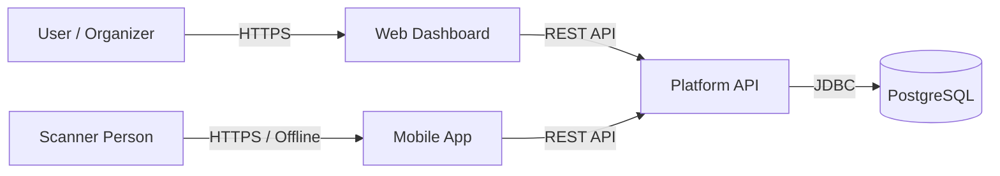
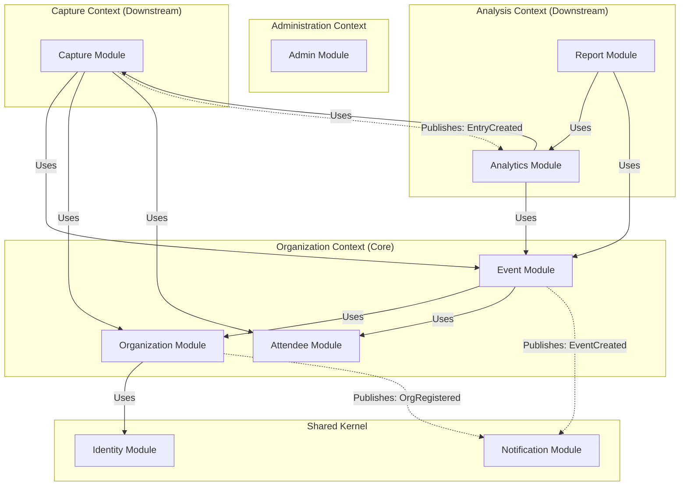
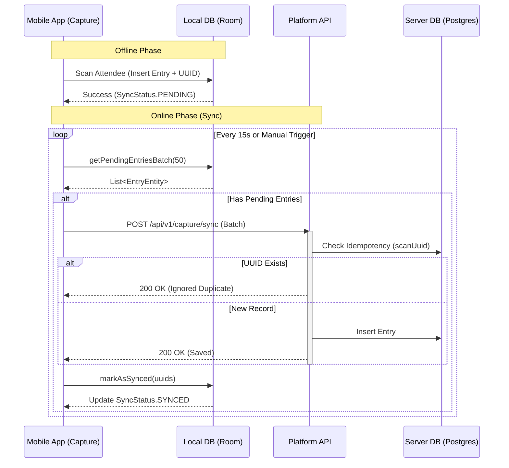
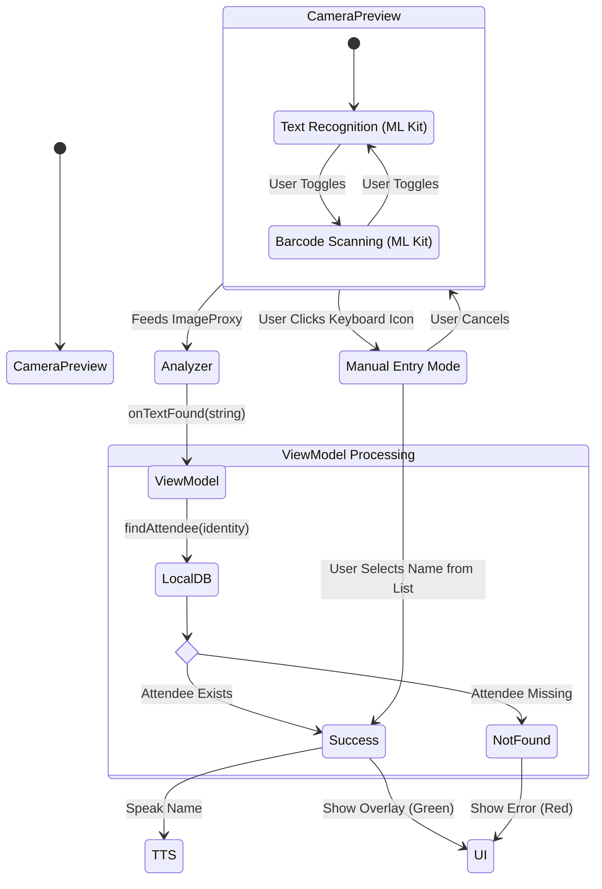
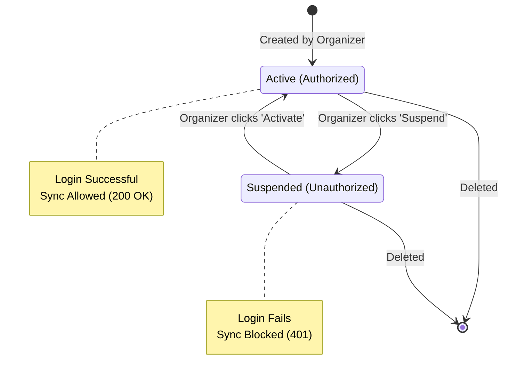

# AttendEx System Architecture

## 1. System Overview

AttendEx is a comprehensive event attendance platform built on a **Modular Monolith** architecture. It solves the challenge of tracking attendance in environments with unreliable internet connectivity by utilizing an **Offline-First** mobile client and a **Hybrid Scanning Engine** (OCR + QR).

### High-Level Components

*   **Web Dashboard (Next.js):** For Organizers to manage events, rosters, and view analytics.
*   **Mobile Scanner (Android Native):** For Scanners to capture attendance using camera-based OCR or QR scanning.
*   **Platform API (Spring Boot):** The central nervous system handling business logic, data consistency, and synchronization.
*   **Database (PostgreSQL):** The persistent storage layer.

---

## 2. Backend Design: Spring Modulith

The backend is structured as a **Modular Monolith**. Unlike a traditional "Layered" architecture (Controller -> Service -> Repository), AttendEx is sliced by **Domain Business Function**.

This ensures that the "Attendance Capture" logic is decoupled from "Organization Management," making the system easier to test and maintain.

### Module Dependency Graph

**Key Architectural Rules (Enforced by ArchUnit):**
1.  **No Cyclic Dependencies:** Modules cannot depend on each other circularly.
2.  **Event-Driven Integration:** The `Capture` module does not write directly to `Analytics`. Instead, it publishes an `EntryCreatedEvent`, which `Analytics` listens to.

---

## 3. Mobile Architecture: Offline-First Sync

The Android application utilizes **Room Database** as the single source of truth for the UI. Network operations effectively "back up" the local database to the server.

### Synchronization Flow (The "Idempotency" Logic)

To prevent duplicate scans when the internet flickers, every scan generates a unique `scanUuid` locally. The server uses this UUID to deduplicate entries.

---

## 4. Hybrid Scanning Engine

The scanning feature is designed to handle legacy ID cards (Text) and modern badges (QR). The system can also fallback to Manual Entry if the camera fails or the ID is damaged.

---

## 5. Security & Data Integrity

The system implements strict **Role-Based Access Control (RBAC)** and allows immediate revocation of access for compromised devices.

*   **Authentication:** Stateless JWT (JSON Web Tokens).
*   **Authorization:**
    *   `ROLE_ORGANIZER`: Full administrative access (Web Dashboard).
    *   `ROLE_SCANNER`: Limited write-access (Mobile App).
*   **Data Integrity:** All offline scans are tagged with a UUID (Idempotency Key). The server rejects duplicates if a scanner tries to sync the same record twice.

### Scanner Access Lifecycle

This diagram illustrates the "Kill Switch" feature. If a scanner device is lost or stolen, the Organizer can **Suspend** the account. This immediately forces the mobile app to stop syncing, protecting the database.

